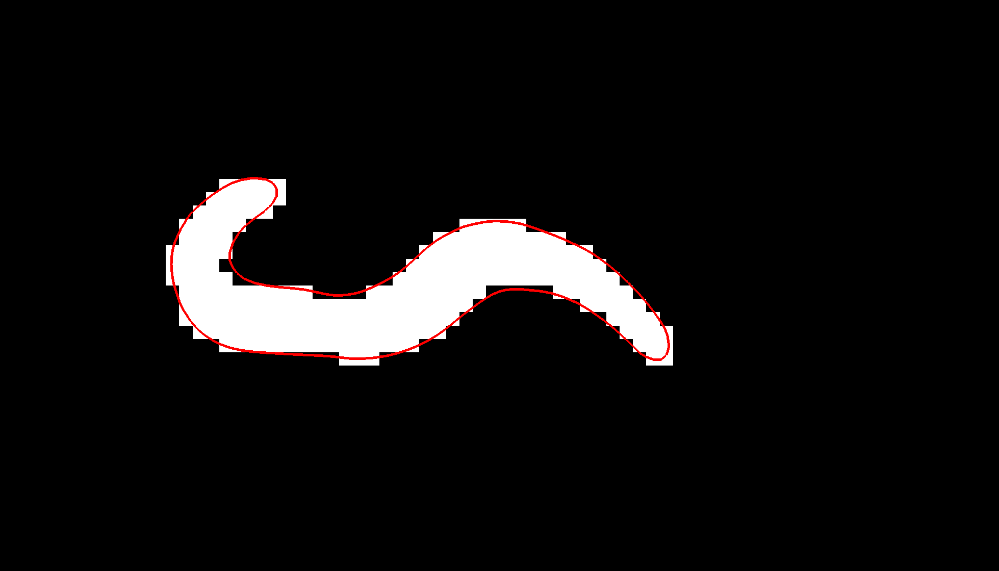
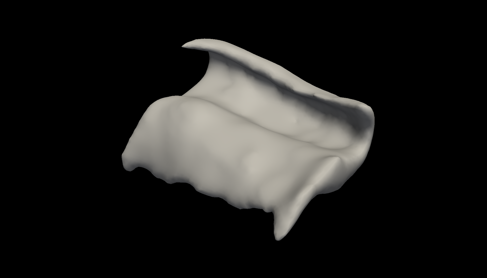

# Tutorial for the hippocampal shape and thickness analysis

This documenent complements the [technical documentation](hipsta/doc/DOCUMENTATION.md) 
of the hippocampal shape and thickness analysis scripts by providing a more 
explanative description of this software. It covers the following topics:

- [Suitable input images](#input-images)
- [Description of processing steps](#processing-steps)
- [Evaluation of the outputs](#evaluating-the-output)
- [Troubleshooting](#troubleshooting)

## Input images

The hippocampal shape and thickness analysis package currently support input 
images that are created by FreeSurfer's hippocampal subfield toolbox or the ASHS 
software. Specifically, the following segmentation images can be used:

- FreeSurfer's hippocampal subfield segmentation from FreeSurfer 7.11 or later.
- Utrecht Medical Center 7T MRI Atlas
- Penn ABC-3T ASHS Atlas for T2-weighted MRI

Segmentation images resulting from one of these atlases can be used as inputs 
for the hippocampal shape and thickness analysis algorithm. For optimal 
segmentation accuracy, we recommend that these segmentations be created from 
high-resolution T2 images of the hippocampal / medial temporal lobe region.

## Processing steps

The hippocampal shape and thickness analysis pipeline consists of a sequence of 
several processing steps. Each step consists of one or more sub-steps, some of 
which can be optional. Each step produces one or more output files and/or 
directories, which can be useful for quality control or troubleshooting.

### 1. Image processing

The first step converts the input to FreeSurfer's mgz format. By default, the 
image is also cropped to the hippocampal region to speed up processing (but this 
can be switched off using the `--no-crop` flag). 

If the `--upsample` argument is used, the image will be sampled to a higher 
resolution to allow for more fine-grained image and surface processing 
operations. Using this option is recommended for images with anisotropic voxels 
or if the voxel edge length is substantially larger than 0.33 mm. If enabeld, 
upsampling will be done to the minimal voxel edge length by default; an 
alternative size can be specified using the `--upsample-size` argument.

The result of processing step 1 ('process image') will be the `<lh|rh>.image.mgz` 
image in the main folder and the `image` subdirectory with intermediate results.

<figure> 
    <center>
    
    <figcaption>image.mgz</figcaption> 
</figure> 

### 2. Label processing

The second step extracts the relevant subfield labels from the segmentation 
image and merges them into a new, reduced segmentation image. If a separate 
label is present for the molecular layer, it will be merged with the adjacent 
CA and subiculum subfields (unless switched off using the `--no-merge-molecular-layer` 
flag`).

If no specific labels for the hippocampal head and/or tail are present in the 
segmentation, the boundaries between the hippocampal body and the head or tail 
need to be detected heuristically with the `automask-head` and/or `automask-tail` 
arguments. More conservative boundaries (i.e. more cropping) are created by the 
`--automask-head-margin` and `--automask-tail-margin` arguments, which can be 
used to add an extra margin (in terms of voxels along the longitudinal axis).

The result of processing step 2 ('process mask') will be the `<lh|rh>.label.mgz` 
image in the main folder and the `label` subdirectory with intermediate results.

<figure> 
    <center>
    
    <figcaption>labels.mgz</figcaption> 
</figure> 

### 3. Mask processing

The third step creates a binary mask from the reduced segmentation image. By 
default, some gaussian filtering will be applied to the binary mask to reduce 
sharp edges; this can be switched off using the `--no_gauss_filter` flag. The 
filter width and threshold can be adjusted using the `--gauss_filter_size` 
argument.

Alternatively or in addition to the gaussian filter, a filter that operates 
exclusively along the longitudinal axis can be used. This can further reduce the
sharp edges in this dimension due to anisoptropic voxels. This filter can 
switched on with the `--long_filter` flag, and can be modified using the `--long_filter_size` 
argument.

Finally, a binary dilation / erosion procedure is applied to the mask to close 
small holes in the segmentation. This can be switched off using the `--no-close-mask` 
flag.

The result of processing step 3 ('process mask') will be the `<lh|rh>.mask.mgz` 
image in the main folder and the `mask` subdirectory with intermediate results.

<figure> 
    <center>
    
    <figcaption>mask.mgz</figcaption> 
</figure> 

### 4. Surface creation

The fourth step converts the binary mask image into a vertex-based surface 
representation. By default, FreeSurfer's marching cube algorithm is used. If it 
does not give good results, it can be changed to the scikit-image algorithm 
using the `--mca` argument. Optionally, a remeshing procedure can be applied to 
the the surface mesh if the vertices are spaced very irregularly; this may not 
always be the case, therefore this step has to be switched on using the `--remesh` 
flag if desired. In any case, the initial surface will be smoothed, the amount 
of which can be controlled using the `--smooth` argument. During this stage, 
several QC plots will be created and placed in the `qc` subdirectory.

The result of processing step 4 ('create surface') will be the `<lh|rh>.surf.vtk`
surface in the main folder and the `surface` subdirectory with intermediate 
results.

<figure> 
    <center>
    
    
    <figcaption>surf.vtk overlaid onto mask.mgz (left) and in 3D view (right)</figcaption> 
</figure> 

### 5. Creation of a tetrahedral mesh

The fifth step fills the interior of the surface mesh with vertices and edges, 
i.e. creates a tetrahedral mesh from the triangular surface mesh.

There are no processing options for this step.

The result of processing step 5 ('create tetrahedral mesh') will be the `<lh|rh>.tetra.vtk`
mesh in the main folder and the `tetra-mesh` subdirectory with intermediate 
results.

### 6. Creation of label files for the tetra mesh

The sixth step will create boundary label files that are used for the next 
processing step, the cutting of the tetrahedral mesh.

There are no processing options for this step.

The intermediate results of processing step 6 ('create label files for tetra 
mesh') are stored in the `tetra-labels` subdirectory.

### 7. Cutting of the tetra mesh at anterior and posterior ends

This step cuts open the tetrahedral mesh at its anterior and posterior ends. It 
also checks whether or not this cutting has been succesful, i.e. if there are 
exactly two boundary loops. If this is not the case, the analysis will be 
terminated at this stage. The range for tetrahedral boundary cutting can be 
modified by the `--cut-range` argument. The default values are `-0.975, 0.975`.

The result of processing step 7 ('cut open tetrahedral mesh') will be the `<lh|rh>.cut.vtk`
mesh in the main folder and the `tetra-cut` subdirectory with intermediate 
results.

<figure> 
    <center>
    
    
    <figcaption>rm.open.bnd.cut.vtk in conjunction with rm.bnd.cut.vtk (left) and alone (right)</figcaption> 
</figure> 

### 8. Cube parametrization

This step computes a 'cube parametrization' on the tetrahedral mesh: it creates 
smooth functions in three anatomically meaningful dimensions across the mesh 
that will form the basis of the 3D coordinate system. Parameters for the cube 
parametrization, in particular the identification of the lateral and medial 
boundaries, can optionally be set using the `--aniso-alpha` and `--aniso-smooth` 
arguments. In addition, QC plots will be created and stored in the `qc` 
subfolder.

The intermediate results of processing step 8 ('create cube parametrization') 
are stored in the `tetra-cube` subdirectory.

### 9. Thickness and curvature computation

This processsing steps conducts the computation of thickness and curvature 
values across the hippocampal mesh. In addition, QC plots will be created and 
stored in the `qc` subfolder.

The optional `--thickness-grid` argument can be used to modify the extent and 
resolution of the grid used for thickness computation. See [below](#additional-arguments-for-ashs-and-freesurfer-segmentations) 
for an explanation.

The primary output of the hippocampal shape and thickness analysis are surface
files and associated thickness values in the `tickness` folder. The estimated 
hippocampal thickness values will be stored in csv tables:

- <lh|rh>.grid-segments-<x|y|z>.csv

Here, x corresponds to the medial-->lateral dimension, y to the 
posterior-->anterior dimension, and z to the exterior-->interior dimension. The 
thickness values are therefore in the z files, whereas the x and y files
contain length estimates for the other two directions.

The thickness values will also be stored as mgh and psol overlay files that
can be overlaid onto the mid-surface vtk file. It is also possible to overlay 
the projected subfield boundary files onto the midsurface: 

- <lh|rh>.mid-surface.vtk
- <lh|rh>.mid-surface.thickness.<mgh|psol>
- <lh|rh>.mid-surface.hsf.<mgh|psol>

<figure> 
    <center>
    
    
    <figcaption>mid-surface.vtk as a surface (left) and with additional triangulation overlay (right)</figcaption>
</figure>     
<figure> 
    <center>
    
    
    <figcaption>overlays of mid-surface.thickness.mgh (left) and mid-surface.hsf.mgh (right) onto mid-surface.vtk </figcaption>
</figure> 

Besides the thickness values, mean and gaussian curvature estimates are
provided for interior, mid, and exterior surfaces:

- <lh|rh>.<int|mid|ext>-surface.vtk
- <lh|rh>.<int|mid|ext>-surface.<mean|gauss>-curv.csv
- <lh|rh>.<int|mid|ext>-surface.<mean|gauss>-curv.mgh
- <lh|rh>.<int|mid|ext>-surface.<mean|gauss>-curv.psol

<figure> 
    <center>
        
    
    <figcaption>overlays of mid-surface.mean-curv.mgh (left) and mid-surface.gauss-curv.mgh (right) onto mid-surface.vtk </figcaption> 
</figure>     

The other files within the 'thickness' folder files are intermediate files that
were created / used during the thickness computation.

### 10. Mapping of subfield labels (and other volume-based data, optional)

The results of processing step 10 will be stored in already existing 
subdirectories and are explained as part of procesing step 9 ('thickness and 
curvature computation').

### 11. Creation supplementary files for visualization

The results of processing step 11 will be stored in already existing 
subdirectories and are explained as part of procesing step 9 ('thickness and 
curvature computation').

## Running an analysis

### Mandatory arguments

An analysis is conduced by calling the `run_hipsta` command. Each analysis 
requires the following arguments:

- `--filename`: Filename of a segmentation file
- `--hemi`: Hemisphere. Either 'lh' (left) or 'rh' (right)
- `--lut` Look-up table ('atlas'). Can be 'freesurfer' or 'ashs-penn_abc_3t_t2' or 'ashs-umcutrecht_7t'. Alternatively, a text file with numeric and verbal segmentation labels can be used.
- `--outputdir`: Output directory where the results will be written.

A minimal command could therefore look like this (for an analysis of the left 
hemisphere in a FreeSurfer segmentation):

```
run_hipsta --filename /path/to/my/segmentation/image --hemi lh  --lut freesurfer --outputdir /path/to/my/output/directory
```

### Additional arguments for ASHS segmentations

Segmentation images that are produced by the ASHS require a set of additional
processing directives in addition to the minimal set of arguments shown above.

It is recommend to use the `--upsample` flag for upsampling the images to the 
smallest voxel edge length. This can be refined more using the `--upsample-size` 
argument.

Since no explicit labels for the hippocampal head are present in ASHS 
segmentations, it will be necessary to use the `--automask-head` flag and 
optionally also the `--automask-tail-margin` argument. If the identification of 
the boundary between hippocampal body tail does not work well given the existing 
labels, using the `--automask-tail` flag and optionally the `--automask-head-margin` 
argument may be advised as well.

### Additional arguments for ASHS and FreeSurfer segmentations

The default grid that is imposed on the hippocampal mid-surface results from a 
3D coordinate system that has a resolution of 41 units along the 
medial-->lateral axis, 21 units along the posterior-->anterior axis, and 11 
units along the outer-->inner axis. 

This resolution - and also the space covered by the coordinate system - can be 
changed using the `--thickness-grid` argument, which determines the extent and 
resolution of the grid used for hippocampal thickness computation, and is 
defined by three lists of three numbers: negative extent of x axis, positive 
extent of x axis, resolution on x axis. Repeat for the y and z axes. The default 
values are `-0.9 0.9 41`, `-0.975 0.975 21`, and `-0.9 0.9 11`.

## Evaluating the output

[...]

## Troubleshooting

In case of an error, the logfile (`logfile.txt` in the main directory) may be 
useful for identifying the cause of the error.

Two types of issues are frequently observed: the presence of holes in the 
surface after processing step 4 and cutting issues after step 7. The program 
checks for the presence of these issues and will terminate if it detects them. 
We outline two strategies to mitigate these issue below.

### Holes in the surface

Holes in the surfaces can be the result of less than optimal image 
preprocessing. We recommend to try adjusting the width and threshold for the 
gausian filter using the `--gauss-filter-size` argument, and optionally to 
employ additional smoothing along the longitudinal axis using the `--long-filter` 
flag (which can be fine-tuned using the `--long-filter-size` argument). It may 
also help to change the surface extraction algorithm using the `--mca` argument.

[...]

### Cutting issues

Another issue may arise with cutting the tetrahedral mesh: this can be due to a 
failure of the automated heuristics for head or tail detection. Or it can simply 
be due to unclean cutting at either end of the hippocampal body so that there 
are more than two boundary loops in total.

<figure> 
    <center>
        
    
    <figcaption>failure of automated head detection (left) and more than two boundary loops (right)</figcaption> 
</figure>    

It will return an error message as follows:

```
[INFO: check_surface.py] There are 3 boundary loops for <...>/tetra-cut/rh.rm.open.bnd.cut.vtk
[INFO: check_surface.py] Surface contains does not contain 2 boundary loops. Please retry with different cutting parameters.
[INFO: hipsta.py] Hipsta finished WITH ERRORS.
<...>
AssertionError: Check surface failed (stage: boundaries)
```

This issue can potentially be solved with more conservative margins for the head 
or tail boundaries, which can be set using the `--automask-head-margin` and
`--automask-tail-margin` arguments. By default they are set to zero, and one 
could try to gradually increase them.

Another potential solution is to choose lower values for the `--cut-range` 
argument; the defaults are set to `-0.975, 0.975`, and better cutting results 
may be obtained with lower absolute values.